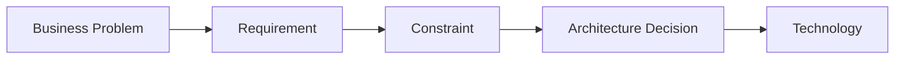
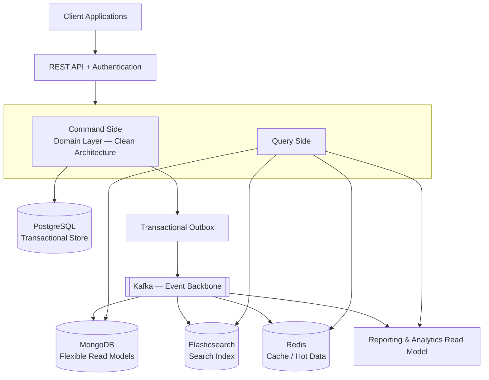
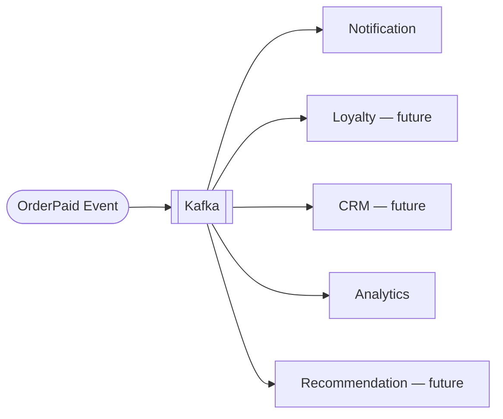
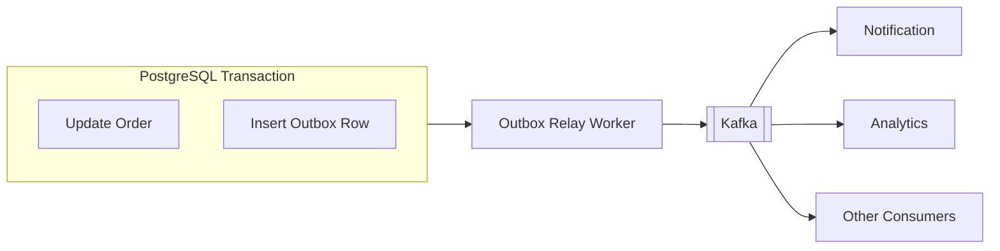
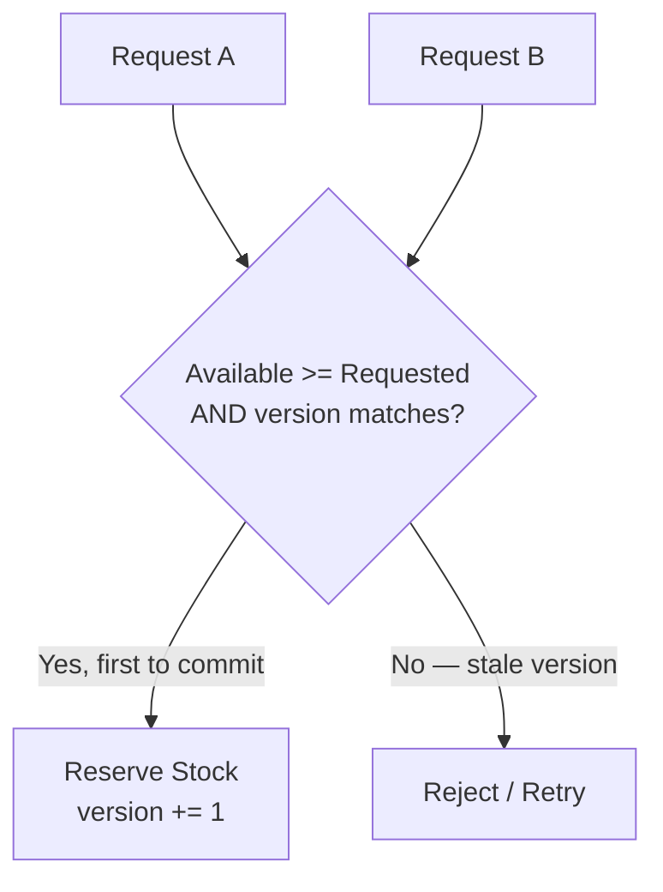
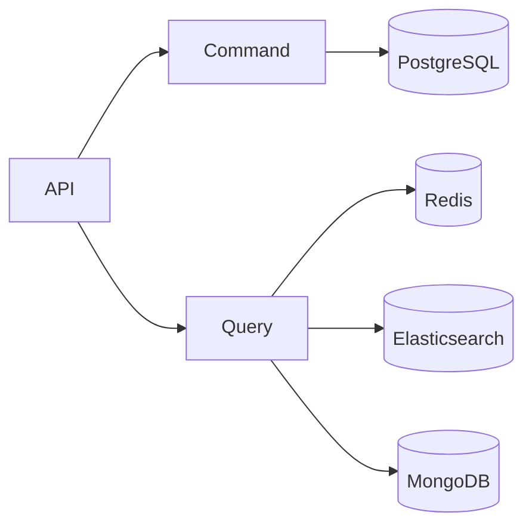
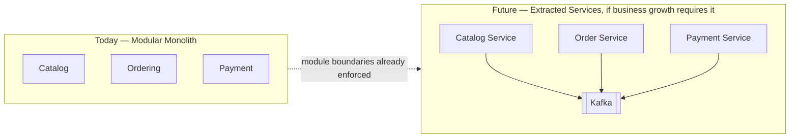
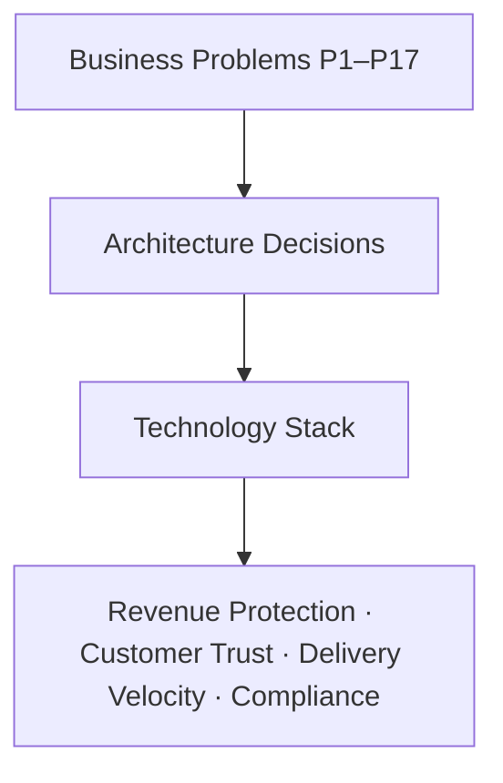

# Solution Architecture — Enterprise Commerce Platform (ECP)

**Document type:** Solution Architecture
**Related document:** [Business Problem Analysis](../BA-docs/BUSINESS-PROBLEM-ANALYSIS.md)
**Audience:** Engineering, Product Management, Architecture Review

---

## 1. Purpose of This Document

The [Business Problem Analysis](../BA-docs/BUSINESS-PROBLEM-ANALYSIS.md) catalogs seventeen business problems (P1–P17) the Enterprise Commerce Platform must solve, independent of any technology. This document takes each of those problems and answers: *what architectural decision addresses it, what technology implements that decision, and why*.

No technology in this stack is included because it is popular or because the stack "should" have it. Every entry below traces back to a specific, named business problem.

---

## 2. Architecture Decision Principle

Every architectural and technology decision in this document follows the same chain of reasoning:

Two decisions in this stack are explicitly **scoped**, not applied universally, and are worth calling out because they are common sources of over-engineering:

- **MongoDB** is not the transactional source of truth. PostgreSQL remains the source of truth for all transactional data. MongoDB is introduced only where a read model's document shape evolves independently of the transactional schema and does not require relational transaction semantics (e.g., flexible, denormalized read views). If a use case does not need that property, MongoDB is not used for it.
- **Kafka** is not required for every inter-module interaction. Within the modular monolith, in-process domain events are sufficient for same-deployment communication. Kafka is introduced specifically where an interaction must cross a durability or distribution boundary — i.e., where the event must survive process restarts, fan out to multiple asynchronous consumers, or eventually cross a service boundary.

---

## 3. High-Level Architecture

This is a **logical** architecture. The system is delivered today as a modular monolith — a single deployable unit with enforced internal module boundaries — not as a set of independently deployed microservices. Section 9 explains how this architecture enables that transition later, if and when the business needs it.

The governing architectural style is: **Modular Monolith + Domain-Driven Design + Clean Architecture + CQRS + Event-Driven Architecture**, with Kafka as the event backbone for interactions that genuinely require asynchronous, durable, multi-consumer delivery.

---

## 4. Business Problem → Architecture Decision Mapping

Each entry below corresponds to the identically-numbered problem in the Business Problem Analysis.

### Theme A — Growth & Extensibility of Business Capability

#### P1. Business domains are multiplying and becoming interdependent

- **Architecture decision:** Organize the codebase around explicit business modules (Catalog, Inventory, Ordering, Payment, Shipping, Promotion, Customer), each owning its own domain model, application services, infrastructure, and a deliberate public API. Everything not exposed through that API is private to the module.
- **Technology:** Domain-Driven Design (Strategic Design) + Spring Modulith.
- **Rationale:** Spring Modulith turns module boundaries from a documentation convention into a structural, verifiable property of the codebase — a module cannot reach into another module's internals, only its public API or its published events. This directly targets P1: a new capability (e.g., a future Loyalty module) can be added without deep changes to Order, Payment, or Inventory, and a change inside one module has a bounded blast radius.

#### P2. New capabilities need to plug into existing business events without destabilizing the core

- **Architecture decision:** Core workflows publish domain events for significant business moments (e.g., `OrderPaid`) instead of directly invoking every interested downstream capability.
- **Technology:** Domain Events (in-process) and Kafka (cross-boundary), consumed independently by each interested capability.
- **Rationale:** This inverts the dependency direction described in P2. The Order module does not need to know that Loyalty, CRM, or Recommendation exist; each of those capabilities subscribes to the event on its own terms. A new capability is added by adding a new consumer, not by modifying the order workflow.

---

### Theme B — Adaptability to Business & Technology Change

#### P3. Dependence on a single provider or vendor increases switching cost and risk

- **Architecture decision:** Domain and application logic depend only on abstractions (ports) that describe *what* is needed (e.g., "process a payment"), never on a specific provider's SDK or protocol. Concrete providers are plugged in as adapters behind those ports.
- **Technology:** Clean Architecture (ports & adapters / hexagonal boundary).
- **Rationale:** This is a direct answer to P3. Swapping a payment provider, adding a second shipping carrier, or integrating an external ERP/CRM system becomes a matter of writing a new adapter, not modifying business logic. It also keeps the domain model free of framework and vendor-specific types, which lowers the cost of every future integration named in the SRS's Future Expansion section.

#### P4. Not all business data needs to be equally up-to-the-millisecond

- **Architecture decision:** Explicitly classify data by the consistency guarantee it actually requires, and apply strong consistency only where the business impact of staleness is unacceptable.
- **Technology:** PostgreSQL with ACID transactions for Order/Payment/Inventory; eventual consistency (via Kafka-propagated events) for Search, Analytics, and Recommendation read models.
- **Rationale:** This makes the trade-off in P4 deliberate instead of accidental. Money and stock get strong consistency because the cost of being wrong is high. Search rankings and dashboards tolerate a few seconds of lag because the cost of staleness there is negligible — and accepting that lag is what allows those read paths to scale independently of the transactional store.

---

### Theme C — Business Rule Integrity & Trust

#### P5. Business rules must hold regardless of how a request enters the system

- **Architecture decision:** Business invariants (e.g., "stock cannot go negative," "an order can only transition through valid states," "only a verified buyer may review a product") are enforced inside the domain model itself — in Aggregates and Domain Services — not in controllers, admin scripts, or individual API handlers.
- **Technology:** DDD Tactical Design (Aggregate Root, Entity, Value Object, Domain Service, Domain Event), reinforced by JMolecules to make these concepts explicit and enforceable in code.
- **Rationale:** Because every entry point — REST API, admin tooling, batch jobs, future mobile clients — routes through the same domain layer, there is exactly one place a rule can be enforced, and it cannot be bypassed by a new or overlooked entry point. This is the structural answer to P5.

#### P6. Business-critical events must never silently disappear between systems

- **Architecture decision:** Persist the intent to publish an event in the same database transaction as the business change it describes, and let a separate, reliable process deliver it to the event backbone.
- **Technology:** Transactional Outbox pattern (PostgreSQL) + Kafka.
- **Rationale:** Writing to a database and publishing to a message broker cannot be done as a single atomic operation, because they are different systems. The Outbox pattern solves this by making the "publish" step part of the same local transaction as the business write, and only that transaction needs to succeed. A separate worker then reliably relays outbox rows to Kafka, guaranteeing that if the business change was committed, the event will eventually be published — directly closing the gap described in P6.

---

### Theme D — Revenue & Financial Integrity

#### P7. A partial failure in the order, payment, or inventory process must not go unnoticed

- **Architecture decision:** All state changes within a single business transaction (e.g., creating an order and reserving inventory) are committed atomically — either the entire unit succeeds, or none of it does.
- **Technology:** PostgreSQL with ACID transaction guarantees.
- **Rationale:** This is the most direct available answer to P7. Atomicity eliminates the class of failure where money is charged without an order existing, or inventory is decremented without a completed sale, which is precisely the risk the business cannot absorb.

#### P8. Sudden concentrated demand must never allow the platform to sell what it does not have

- **Architecture decision:** Stock changes under concurrent access are validated and applied atomically, with an explicit reservation state between "available" and "confirmed" stock, rather than a simple read-then-write that can race.
- **Technology:** PostgreSQL optimistic locking (versioned updates with a conditional `WHERE`) combined with an availability/reservation/confirmation stock model; Redis for high-throughput reservation counters where extreme concurrency (flash sales) requires it.
- **Rationale:** A naive "read stock, subtract, write stock" sequence allows two concurrent requests to both read the same available quantity and both succeed, overselling the product. Conditional, versioned updates guarantee that a stock decrement only succeeds if the previously-read state is still valid, directly preventing the overselling scenario described in P8.

---

### Theme E — Peak-Demand & Operational Resilience

#### P9. The platform's highest-traffic moments are also its highest-revenue moments

- **Architecture decision:** Absorb read-heavy and repeated-access traffic in front of the transactional database, so a demand spike does not directly translate into a database load spike.
- **Technology:** Redis as a cache-aside layer for hot data (popular products, categories, cart, session, rate limiting), combined with the reservation-based concurrency control from P8 for the write path.
- **Rationale:** During a flash sale, the overwhelming majority of requests are reads (viewing the product, checking stock) rather than writes (completing a purchase). Redis absorbs that read volume with sub-millisecond latency, keeping PostgreSQL free to handle the smaller but critical volume of writes — which is exactly what P9 requires: the system must not degrade at the moment it matters most.

#### P10. Growth in customers, products, and orders must not translate into proportionally worse performance or cost

- **Architecture decision:** Query patterns that are known and frequent (e.g., "a customer's orders, most recent first") are supported by purpose-built database indexes rather than relying on full table scans that degrade as data volume grows.
- **Technology:** Database indexing strategy aligned to actual query patterns (e.g., composite index on `(customer_id, created_at)`).
- **Rationale:** As order volume grows from thousands to millions of rows, an unindexed query's cost grows with it, while an indexed query's cost stays roughly flat. This directly addresses P10 by decoupling response latency and infrastructure cost from data growth, and delays or removes the need for more expensive scaling strategies (sharding, read replicas).

---

### Theme F — Customer Experience & Conversion

#### P11. Customers who cannot quickly find what they want will leave without buying

- **Architecture decision:** Product discovery (full-text search, filtering, ranking, autocomplete) is served by a purpose-built, denormalized search read model, kept in sync with the transactional catalog via events rather than queried live from it.
- **Technology:** Elasticsearch, populated via Kafka events published from the Catalog module.
- **Rationale:** Relational pattern-matching queries (e.g., `LIKE '%keyword%'`) do not scale to fast, relevant, filterable search at catalog sizes in the tens of thousands of products and beyond. A dedicated search index directly targets P11 — the business problem of lost conversion due to poor product discovery — by making search fast and relevant regardless of catalog size.

#### P12. Precise transaction handling and fast, flexible browsing are two different jobs the platform must do equally well

- **Architecture decision:** Separate the write path (commands that change state) from the read path (queries that serve data), allowing each to be modeled, optimized, and scaled independently.
- **Technology:** CQRS — commands against PostgreSQL; queries against purpose-built read models (Elasticsearch for search, Redis for hot reads, MongoDB/reporting store for flexible or aggregated views).
- **Rationale:** This is the structural answer to P12. Instead of one data model trying to simultaneously guarantee transactional integrity and serve fast, denormalized reads — and doing both poorly — each side is optimized for what it actually needs to do.

---

### Theme G — Operational Intelligence

#### P13. Leadership needs timely visibility into the business without slowing down the business itself

- **Architecture decision:** Reporting and analytics are served from a dedicated read model built from the same business events used elsewhere, rather than running aggregate queries (JOINs, SUM, GROUP BY) directly against the live transactional tables.
- **Technology:** CQRS + event-driven projection into a reporting-optimized store, fed by Kafka.
- **Rationale:** An admin dashboard running heavy aggregate queries against the same tables that customer checkout depends on creates direct resource contention between the two. Projecting a separate reporting model from business events removes that contention entirely, which is precisely what P13 requires: analytics and transactions stop competing for the same resources.

---

### Theme H — Organizational & Delivery Sustainability

#### P14. Delivery teams working on different parts of the business must not block each other

- **Architecture decision:** The same module boundaries introduced for P1 double as ownership boundaries for delivery teams — a Catalog team can develop against Catalog's public API without needing to coordinate line-by-line with the Order team.
- **Technology:** Spring Modulith module structure, aligned to team ownership.
- **Rationale:** Because the enforced module boundary already limits how one area of the system can depend on another's internals, teams working in different modules are structurally prevented from creating the kind of tight coupling that would otherwise force them to coordinate on every change — directly addressing P14 as headcount grows.

#### P15. Without ongoing discipline, the platform's structure will erode and every future feature will cost more than the last

- **Architecture decision:** Architectural rules (dependency direction, module boundaries, layering) are expressed as automated tests that run in continuous integration, not as documentation that developers are expected to remember.
- **Technology:** ArchUnit (dependency and layering rules) + JMolecules (explicit DDD building blocks) + Spring Modulith's own boundary verification.
- **Rationale:** A rule that only exists in a document degrades the moment someone doesn't read it. A rule enforced by a failing build cannot be silently violated. This turns architecture quality from "developer discipline" into a verifiable constraint, which is the direct, durable answer to the erosion described in P15.

---

### Theme I — Risk, Security & Accountability

#### P16. Every role in the business must be able to do exactly what its job requires — no more, no less

- **Architecture decision:** Every operation is authorized against the caller's role before it executes, with roles that map directly to real business functions (Customer, Staff, Warehouse, Customer Support, Administrator).
- **Technology:** Role-Based Access Control (RBAC) enforced at the API/application boundary, backed by JWT-based authentication with refresh tokens.
- **Rationale:** This maps directly onto P16: the platform's roles are not an abstract technical concept but a reflection of real job functions, and enforcing them consistently prevents the exact failure mode described in the business problem — a role performing an action outside its intended scope.

#### P17. The business must be able to answer "who did this, when, and why" for every significant action

- **Architecture decision:** Every significant business action (price change, inventory adjustment, order cancellation, refund approval, promotion creation) produces an immutable audit record capturing the actor, the timestamp, the before/after state, and, where applicable, a reason.
- **Technology:** Append-only audit logging, populated from the same domain events used elsewhere in the architecture.
- **Rationale:** Because audit records are derived from domain events already being published for other purposes (P2, P6), accountability is achieved without duplicating business logic — every meaningful action is already an event, and audit logging is simply one more consumer of it. This directly satisfies P17's requirement for traceability and immutability.

---

## 5. Technology Stack Summary

| Technology | Business Problem(s) Addressed | Business Value |
|---|---|---|
| Domain-Driven Design (Strategic + Tactical) | P1, P5 | Clear business boundaries; rules enforced consistently everywhere |
| Spring Modulith | P1, P14 | Verifiable module boundaries; supports team scaling |
| Clean Architecture | P3 | Low switching cost for vendors/providers; framework-independent domain |
| CQRS | P12, P13 | Transactions and reads scale and evolve independently |
| PostgreSQL | P4, P7, P8 | ACID guarantees protect money, orders, and inventory |
| Optimistic Locking / Reservation Model | P8 | Prevents overselling under concurrent demand |
| Transactional Outbox | P6 | No business event is ever silently lost |
| Apache Kafka | P2, P6, P9, P11, P13 | Reliable, decoupled distribution of business events |
| Event-Driven Architecture | P2, P4 | New capabilities plug in without core coupling |
| Elasticsearch | P11 | Fast, relevant product search drives conversion |
| Redis | P9 | Absorbs traffic spikes; low-latency hot data |
| MongoDB | P4 (scoped) | Flexible read models where relational structure isn't needed |
| Database Indexing | P10 | Query performance and cost stay flat as data grows |
| Reporting Read Model (CQRS projection) | P13 | Business intelligence without impacting checkout |
| ArchUnit | P15 | Architecture rules enforced automatically in CI |
| JMolecules | P5, P15 | DDD concepts made explicit and checkable in code |
| RBAC + JWT Authentication | P16 | Access limited to what each role legitimately needs |
| Audit Logging | P17 | Every significant action is traceable and immutable |
| MapStruct | P3 | Clean mapping between domain, persistence, and API layers without leaking framework concerns into the domain |
| Lombok | P15 | Reduces boilerplate, keeping the codebase easier to review and maintain |

---

## 6. Architecture Governance

Architecture decisions are only as durable as the mechanism that enforces them. Three tools work together to keep the system's structure from drifting away from the decisions above over time:

- **Spring Modulith** verifies, at build time, that no module reaches into another module's internal (non-API) packages.
- **ArchUnit** encodes layering and dependency-direction rules (e.g., "Domain must not depend on Infrastructure") as executable tests.
- **JMolecules** makes DDD building blocks (Aggregate, Entity, Value Object, Domain Event) explicit types in code, so architectural intent is visible and checkable rather than implicit convention.

Together, these convert P15 from an ongoing manual review burden into an automated CI gate: a change that violates architectural boundaries fails the build before it can be merged.

---

## 7. Delivery Roadmap

The architecture is deliberately delivered in a sequence that builds each layer on top of a working prior layer, rather than attempting all capabilities simultaneously.

| Phase | Focus | Problems Addressed | Primary Technology |
|---|---|---|---|
| 1 | Modular foundation | P1, P14 | DDD (Strategic) + Spring Modulith |
| 2 | Domain modeling & invariants | P5 | DDD (Tactical) + Clean Architecture |
| 3 | Concurrency-safe inventory | P7, P8 | PostgreSQL transactions + optimistic locking |
| 4 | Read/write separation | P12 | CQRS |
| 5 | Reliable event distribution | P2, P6 | Domain Events + Transactional Outbox + Kafka |
| 6 | Caching & traffic absorption | P9 | Redis (cache-aside) |
| 7 | Product search | P11 | Elasticsearch |
| 8 | Operational intelligence | P13 | CQRS projection + reporting read model |
| 9 | Query performance at scale | P10 | Database indexing |
| 10 | Architecture governance | P15 | ArchUnit + JMolecules |

Security (P16) and audit (P17) are treated as cross-cutting concerns implemented alongside every phase above, rather than as a discrete late-stage phase — access control and traceability must exist from the first transactional workflow onward, not be retrofitted.

---

## 8. Path to Microservices

The platform is delivered today as a **modular monolith**, not a set of independently deployed services. This is a deliberate choice, not a limitation: at the current scale, a single deployable unit with enforced internal boundaries delivers the benefits described above (P1, P14) with lower operational overhead than a distributed system would require.

Because module boundaries (P1) are enforced today rather than assumed, and cross-module communication already favors events over direct calls (P2, P6) where durability matters, extracting any individual module into its own deployable service — should the business reach a scale that requires it — is a boundary-preserving change rather than a rewrite. Spring Modulith is therefore best understood not as "microservices in disguise," but as the mechanism that keeps that future option open without paying its operational cost today.

---

## 9. Summary

No technology decision in this architecture stands on its own. Each one is the answer to a specific, named business problem from the [Business Problem Analysis](../BA-docs/BUSINESS-PROBLEM-ANALYSIS.md):

Where a technology's application is not justified by a specific problem — as called out in Section 2 for MongoDB and Kafka — its use is deliberately scoped rather than applied universally, to keep the architecture aligned with actual business need rather than technology adoption for its own sake.
